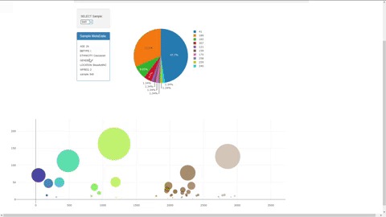

# Project Name: Belly Button Biodiversity

[Heroku deployment](https://bh-belly-button.herokuapp.com/)

## Purpose
To provide a dashboard to explore samples taken from various belly buttons.

## Requirements
1. Python 3.6.8
2. pip
3. pandas==0.24.2
4. SQLAlchemy==1.3.1
5. Flask==1.0.2
6. Flask_SQLAlchemy==2.4.0

## Steps
1. Run pip install -r requirements.txt
2. Run app.py
